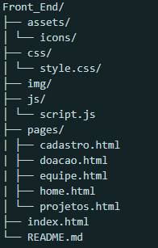
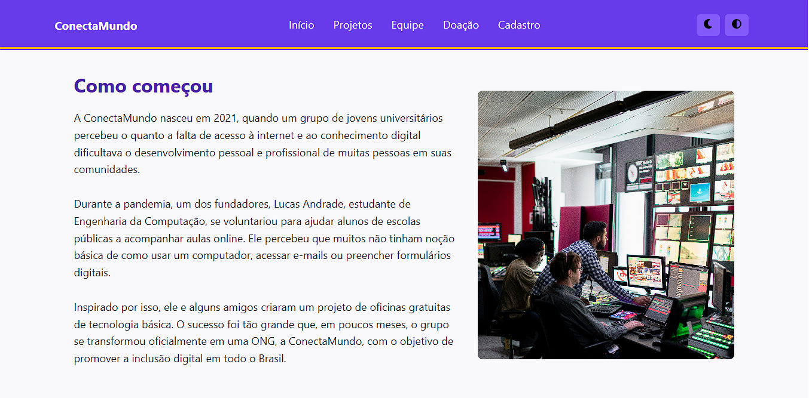
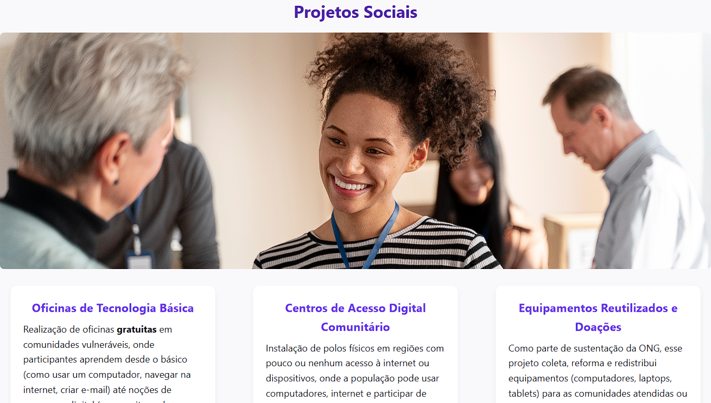
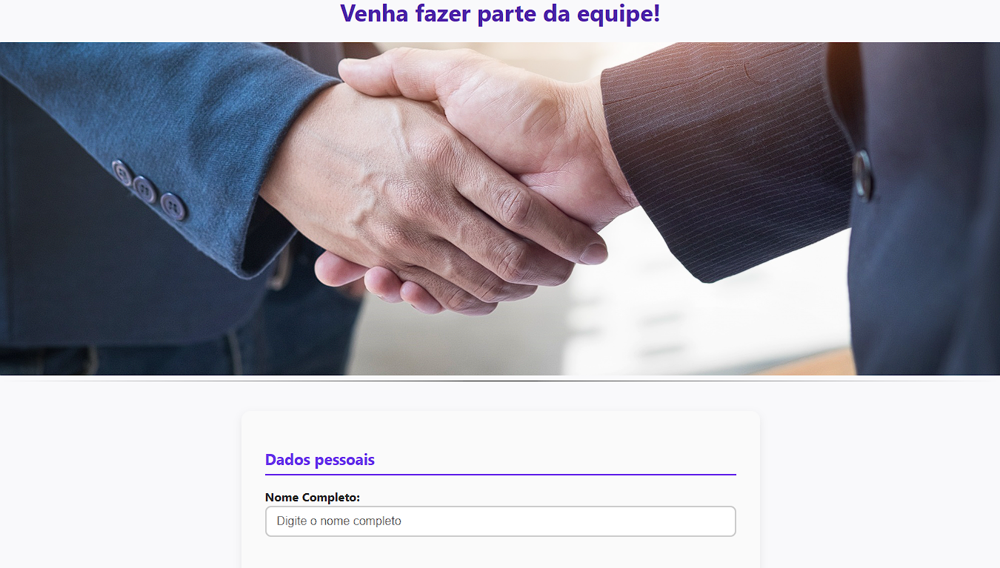

# 🌐 ConectaMundo

> Projeto desenvolvido como parte do curso na **Cruzeiro do Sul Virtual**, com foco em acessibilidade, usabilidade e boas práticas de desenvolvimento front-end.

---

## 📖 Sobre o Projeto

O **ConectaMundo** é uma ONG fictícia criada com o objetivo de promover a **inclusão digital** de pessoas em situação de vulnerabilidade social.  
O site apresenta informações institucionais, equipe, projetos realizados e oportunidades de colaboração, tudo dentro dos padrões de **acessibilidade (WCAG 2.1 Nível AA)**.

Este projeto foi desenvolvido com foco em:
- Estrutura semântica e navegação acessível;
- Design responsivo;
- Modo escuro e modo de alto contraste;
- Código limpo e versionado com GitFlow.

---

## 🧠 Objetivos Técnicos

- Aplicar boas práticas de **HTML semântico** e **CSS modular**;
- Implementar **acessibilidade digital** e navegação por teclado;
- Garantir **contraste mínimo de 4.5:1** para textos e botões;
- Desenvolver **modo escuro** e **modo de alto contraste** com alternância dinâmica;
- Aplicar **GitFlow**, commits semânticos e versionamento semântico;
- Otimizar o projeto para produção com **minificação de HTML, CSS e JS**, e **compressão de imagens**.

---

## 🧰 Tecnologias Utilizadas

| Tecnologia | Função |
|-------------|--------|
| **HTML5** | Estrutura semântica das páginas |
| **CSS3** | Estilização e responsividade |
| **JavaScript** | Interatividade (modos escuro e contraste) |
| **Git / GitHub** | Controle de versão e versionamento semântico |
| **Acessibilidade (WCAG 2.1 Nível AA)** | Verificação de acessibilidade e performance |

---

## ⚙️ Funcionalidades Principais

✅ Estrutura semântica e compatível com leitores de tela  
✅ Navegação por teclado em todos os componentes  
✅ Alternância entre **modo claro**, **modo escuro** e **modo alto contraste**  
✅ Layout totalmente **responsivo**  
✅ Boas práticas de **UX e UI**  
✅ Otimização para **performance e SEO**  
✅ Commits e branches seguindo o **GitFlow**

---

## 🧩 Estrutura de Pastas

 

---

## 🎨 Acessibilidade

O site segue as diretrizes da **WCAG 2.1 (Nível AA)**:

- Navegação completa por teclado;
- Alto contraste ativável;
- Elementos com foco visível;
- Texto com contraste mínimo de **4.5:1**;
- Uso de **elementos semânticos** (`header`, `main`, `article`, `nav`, `footer`, etc.);
- Compatibilidade com **leitores de tela (NVDA, JAWS)**.

---

## 🌗 Modos de Exibição

- **Padrão (claro)**  
- **Modo Escuro (`body.dark`)**  
- **Modo Alto Contraste (`body.high-contrast`)**

---

## 🖼️ Screenshots

| Página | Visual |
|--------|---------|
| Página Inicial |  |
| Projetos |  |
| Cadastro |  |
