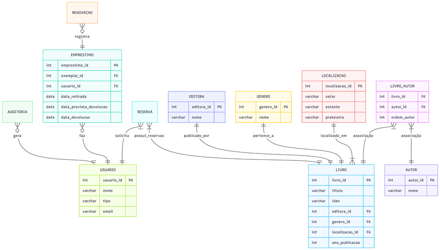

# 📚 BookVerse – Sistema de Gerenciamento de Biblioteca

Projeto de Banco de Dados – DER, Normalização, Scripts SQL e Operações CRUD

---

## 📌 Descrição do Projeto

O **BookVerse** é um sistema de gerenciamento para uma biblioteca física, projetado para organizar livros, autores, editoras, usuários e operações de empréstimo.  
O objetivo é aplicar conceitos fundamentais de **modelagem de dados**, **normalização até 3FN**, e implementação do banco utilizando **MySQL**.

O projeto inclui:

- Modelo Conceitual / DER  
- Modelo Lógico normalizado (1FN, 2FN e 3FN)  
- Scripts de criação de tabelas (DDL)  
- Scripts de povoamento (INSERTs)  
- Consultas SQL (SELECT)  
- Scripts de UPDATE e DELETE  
- Scripts seguros considerando chaves estrangeiras  
- Instruções de execução via XAMPP + phpMyAdmin  

---

---

## 🧩 DER – Diagrama Entidade Relacionamento

📎 DER:  
 

---

## 🛠️ Tecnologias Utilizadas

- MySQL 
- XAMPP / MariaDB  
- phpMyAdmin  
- SQL

---

## 🏗️ Como Executar o Projeto

**1. Iniciar o XAMPP**  
- Abra o XAMPP Control Panel  
- Inicie Apache (opcional)  
- Inicie MySQL  

**2. Abrir o phpMyAdmin**  
Acesse no navegador:  
`http://localhost/phpmyadmin`

**3. Criar o Banco de Dados**  
No phpMyAdmin → SQL:
- Vá em importar → Selecione:
- create_tables.sql

**4. Inserir os Dados**   
No phpMyAdmin importe:
- insert_data.sql

**5. Testar Consultas**   
No phpMyAdmin importe:
- select_queries.sql

**6. Para testar UPDATE e DELETE**   
No phpMyAdmin importe:
- update.sql
- delete.sql

## 📄 Scripts Incluídos

### 📌 1. CREATE TABLES (DDL)
**Arquivo:** `create_tables.sql`  
Inclui tabelas:  
- **livro**  
- **autor**  
- **editora**  
- **genero**  
- **usuario**  
- **livro_autor**
- **livro_editora**
- **livro_genero**
- **exemplar**  
- **localizacao**  
- **emprestimo**  
- **renovacao**  
- **reserva**  

Com todas as **chaves primárias e estrangeiras**.

---

### 📌 2. INSERTS (DML)
**Arquivo:** `insert_data.sql`  
Contém dados reais para teste

---

### 📌 3. SELECTS
**Arquivo:** `select_queries.sql`  
Inclui consultas:  
- Listar livros com autor e gênero  
- Buscar usuários com empréstimos ativos  
- Livros mais emprestados  
- Empréstimos vencidos  
- Livros por editora  

---

### 📌 4. UPDATE
**Arquivo:** `update.sql`  
Inclui:  
- Atualizar telefone de usuário  
- Atualizar status de exemplar  
- Atualizar data prevista de devolução  

---

### 📌 5. DELETE
**Arquivo:** `delete.sql`  
Inclui **deletes normais** 

---

## 🧠 Normalização Aplicada

✔️ **1FN – Primeira Forma Normal**  
- Todas as entidades possuem atributos atômicos  
- Não têm repetições  
- Linhas são únicas  

✔️ **2FN – Segunda Forma Normal**  
- Aplicada principalmente nas tabelas de chave composta:  
  - **livro_autor**  
  - **livro_editora**  
  - **livro_genero**  

✔️ **3FN – Terceira Forma Normal**  
- Sem dependências transitivas  
- Atributos dependem apenas da chave  
